# A jornada do analista de dados

Análise de dados com IA em todas as etapas, do problema à decisão, com um humano aprovando cada passagem.

**Autores:** Felipe Marins e Claude · **Professor:** Marino Hilario Catarino · Data Science 2 · ESEG · 2026

## Links principais

| | |
|---|---|
| **Apresentação em jogo** | [abrir no navegador](https://felipe44776-eseg.github.io/jornada-analista-dados/) |
| **Apresentação técnica**, 31 slides | [abrir no navegador](https://felipe44776-eseg.github.io/jornada-analista-dados/deck-31-slides/) |
| **Como usar**, passo a passo | [`docs/como-usar.md`](docs/como-usar.md) |
| **Onde pôr a base de dados** | [passo 3 do guia](docs/como-usar.md#passo-3--ponha-a-base-de-dados-no-lugar-certo) |
| **O que escrever para a IA** | [os prompts, do começo ao fim](docs/como-usar.md#2-o-que-você-escreve-do-começo-ao-fim) |
| **O método em uma página** | [`docs/resumo-da-tecnica.md`](docs/resumo-da-tecnica.md) |
| **Referências, com DOI** | [`docs/referencias-da-apresentacao.md`](docs/referencias-da-apresentacao.md) |
| **Criar o seu projeto a partir deste** | [usar este modelo](https://github.com/felipe44776-eseg/jornada-analista-dados/generate) |

Este repositório é um **modelo de projeto**. Você cria uma cópia, preenche um arquivo com o seu tema e as suas referências, e a IA conduz a análise etapa por etapa: explica o que vai fazer, mostra as decisões que tomou e para em cada portão para você decidir.

## O que tem em cada pasta

| Pasta ou arquivo | O que tem | Quem usa |
|---|---|---|
| [`PROJETO.md`](PROJETO.md) | o arquivo que você preenche: tema, pergunta, dados, referências | você |
| [`AGENTS.md`](AGENTS.md) | as instruções do processo para a IA: papel, ciclo, portões, regras e travas | a IA |
| [`CLAUDE.md`](CLAUDE.md) | carrega o `AGENTS.md` e o `PROJETO.md` no Claude Code | a IA |
| [`etapas/`](etapas/) | 13 arquivos, um por etapa: missão, roteiro, armadilhas e prompts prontos | a IA e você |
| [`templates/`](templates/) | 18 modelos dos documentos que as etapas produzem | a IA |
| [`referencias/`](referencias/) | material de consulta: frameworks, catálogo de fontes externas, guia de testes estatísticos, guia de gráficos, riscos de IA, glossário e bibliografia | a IA e você |
| [`docs/`](docs/) | as duas apresentações, o guia de uso, o resumo do método e as referências | você |
| [`docs/fonte/`](docs/fonte/README.md) e [`docs/verificacao/`](docs/verificacao/README.md) | o código da apresentação em jogo e o que a confere | quem quiser mexer na apresentação |
| [`pesquisa/`](pesquisa/) | 4 relatórios com as fontes: frameworks de processo; análise, rigor e comunicação; IA na análise de dados; fontes de dados externas | quem quiser conferir de onde veio cada ideia |
| [`verificacao/`](verificacao/README.md) | os testes do kit | quem mantém o kit |
| `.devcontainer/` | o ambiente pronto do GitHub Codespaces | o GitHub |

A etapa 00 cria o resto, no seu projeto: `dados/` (a sua base, fora do git), `analise/` (os scripts), `resultados/` (os números), `figuras/`, `saidas/` (os documentos de cada etapa) e `apresentacoes/`. Não edite `AGENTS.md`, `etapas/`, `templates/` nem `referencias/` durante a análise.

> A IA lê o [`AGENTS.md`](AGENTS.md). Você lê este arquivo. Termos técnicos estão em [`referencias/glossario.md`](referencias/glossario.md).

## Tutoriais: escolha a sua ferramenta

O guia completo está em [`docs/como-usar.md`](docs/como-usar.md). Cada link abaixo abre o passo a passo de uma ferramenta.

| Provedor | Ferramenta | Como trabalha | Passo a passo |
|---|---|---|---|
| Anthropic | **Claude Code** | agente no terminal | [abrir o tutorial](docs/como-usar.md#claude-code) |
| Anthropic | **Claude Cowork** | agente no app de desktop | [abrir o tutorial](docs/como-usar.md#claude-cowork) |
| Anthropic | **claude.ai** | conversa no navegador | [abrir o tutorial](docs/como-usar.md#claudeai-no-navegador) |
| OpenAI | **Codex** | agente no terminal | [abrir o tutorial](docs/como-usar.md#codex) |
| OpenAI | **ChatGPT** | conversa no navegador | [abrir o tutorial](docs/como-usar.md#chatgpt-no-navegador) |
| Google | **Antigravity** | agente em app, IDE ou terminal | [abrir o tutorial](docs/como-usar.md#antigravity) |
| Google | **Gemini CLI** | agente no terminal, só com chave paga | [abrir o tutorial](docs/como-usar.md#gemini-cli) |
| Google | **Gemini** | conversa no navegador | [abrir o tutorial](docs/como-usar.md#gemini-no-navegador) |

Não sabe qual usar? Veja [qual ferramenta escolher](docs/como-usar.md#3-qual-ferramenta-escolher) e o [prompt de partida](docs/como-usar.md#para-começar), que vale para todas.

## Comece em 6 passos

Este é o caminho mais curto: tudo no navegador, pelo GitHub Codespaces, com o Claude Code. O Claude Code pede um plano pago do Claude, e o Codespaces segue a cota da sua conta do GitHub. Há caminhos com conta gratuita no [guia](docs/como-usar.md#3-qual-ferramenta-escolher).

1. **Crie o seu repositório.** No topo desta página, clique em **Use this template** e depois em **Create a new repository**. Se os seus dados não forem públicos, marque **Private**.
2. **Abra o ambiente.** No seu repositório, clique em **Code**, na aba **Codespaces**, e em **Create codespace on main**. Em alguns minutos abre um editor no navegador, com Python e as ferramentas já instalados.
3. **Preencha o [`PROJETO.md`](PROJETO.md).** Tema, pergunta, dados e referências. É o único arquivo que você escreve para começar.
4. **Ponha os dados em `dados/brutos/`** e crie o cofre. Arraste os arquivos para a pasta e, no terminal, rode:

   ```bash
   mkdir -p ../cofre && export COFRE_DIR="$(cd ../cofre && pwd)"
   ```

   Se você não tem dados, diga isso no `PROJETO.md`: a etapa 03 procura bases públicas.
5. **Chame a IA.** No mesmo terminal, digite `claude`, faça o login e escreva:

   ```text
   Comece pela etapa 00.
   ```

   O [`CLAUDE.md`](CLAUDE.md) já carrega as instruções do processo e o seu `PROJETO.md`.
6. **Decida em cada portão.** A IA para e mostra um resumo. Escreva `Semente: 4217` (um número qualquer), rode de novo os scripts dos 2 números que ela sortear e responda com uma destas frases:
   - `Aprovo G3`
   - `Ajustar: <o quê>`
   - `Voltar à etapa 02: <motivo>`

   Depois de aprovar, o commit e a tag do portão são seus (`git tag G3`). Nos portões ★ há ainda uma âncora fora do projeto. O [guia](docs/como-usar.md#em-cada-portão) mostra a conversa inteira.

### Antes de subir qualquer dado

- **Tudo o que a IA vê vai para o provedor dela.** Dado pessoal não entra em conversa: a IA lê os dados por script que imprime só contagens e totais. A regra completa está na [etapa 00](etapas/00-kickoff.md).
- **Repositório com dado que não é público tem de ser privado.** A pasta `dados/` já fica fora do git por padrão.
- **As ferramentas de IA têm regras de acesso próprias**, e algumas pedem plano pago. Veja o [guia](docs/como-usar.md#3-qual-ferramenta-escolher).

## O funil

A cada fase entra mais do que sai. Cada filtro é um portão aprovado por humano.

```text
 ┌──────────────────────────────────────────────────────────────┐
 │ 1 ENQUADRAR   muitas perguntas ─► 1 pergunta ligada a decisão  │  00 · 01
 └┐                                                            ┌┘
  │ 2 REUNIR     todas as fontes ─► internas + externas aptas, │    02 · 03 · 04
  │              preparadas; confirmação guardada no cofre     │
  └┐                                                          ┌┘
   │ 3 EXPLORAR  gráficos ─► hipóteses travadas (+ modelo)    │     05 · 06
   └┐                                                        ┌┘
    │ 4 COMPROVAR cofre aberto uma vez ─► evidências        │      07 · 08
    │             testadas, robustas e trianguladas          │
    └┐                                                      ┌┘
     │ 5 COMUNICAR evidências ─► até 5 insights ─► 1 decisão│       09 · 10 · 11 · 12
     └──────────────────────────────────────────────────────┘
```



```mermaid
flowchart LR
  subgraph F1["1 · Enquadrar"]
    E00["00 Kickoff"] --> E01["01 Problema e decisão ★"]
  end
  subgraph F2["2 · Reunir"]
    E02["02 Dados internos"] --> E03["03 Dados externos ★"] --> E04["04 Preparação e cofre"]
  end
  subgraph F3["3 · Explorar (só exploração)"]
    E05["05 Exploração e pré-registro ★"] --> E06["06 Modelagem (condicional)"]
  end
  subgraph F4["4 · Comprovar (confirmação aberta 1 vez)"]
    E07["07 Testes confirmatórios"] --> E08["08 Validação e triangulação ★"]
  end
  subgraph F5["5 · Comunicar"]
    E09["09 Insights"] --> E10["10 Deck técnico"] --> E11["11 Deck executivo ★"] --> E12["12 Entrega e retro"]
  end
  E01 --> E02
  E04 --> E05
  E06 --> E07
  E08 --> E09
  E08 -. "achado caiu: novo ciclo (máx. 2)" .-> E05
  E05 -. "pergunta errada" .-> E01
```

## Os quatro pilares e as travas

| Pilar | Responde a | Em uma frase |
|---|---|---|
| **Funil** | *o quê* | 13 etapas em 5 fases, cada uma com missão, entradas e artefato de saída |
| **Ciclo PEVD** | *como* | em cada etapa a IA **P**laneja (com expectativa declarada), **E**xecuta (em código), **V**erifica (primeiro o determinístico) e o humano **D**ecide |
| **Portões** | *quem decide* | só humano aprova, com a frase literal registrada; 5 são críticos (★) e pedem segunda pessoa |
| **Artefatos** | *onde fica* | o estado mora em arquivos, não no chat; todo número vem de `resultados/*.json`, escrito por script |

**Travas externas** (o princípio "determinístico onde dá, IA onde há julgamento" levado a sério):

| Trava | O que impede |
|---|---|
| **Cofre da confirmação**: pasta fora do projeto (`COFRE_DIR`), guardada pelo humano até a etapa 07 | "dar uma olhadinha" nos dados que vão testar a hipótese |
| **Registro travado** (e modelo congelado): cópia somente leitura, com tag própria (`trava-registro`, `trava-modelo`) ancorada fora: numa mensagem do humano, ou num remoto com proteção de tags testada no G0. Tag só local não basta | mudar a hipótese depois de ver o resultado |
| **Commit com tag por portão**, feito pelo humano; nos ★, com âncora externa, registrada numa DEC do tipo `âncora` | reescrever em silêncio um artefato aprovado |
| **Resultados emitidos por script** (`resultados/*.json`, com o script de origem) | número digitado errado no artefato ou no deck |
| **Aprovação literal** + **sorteio de 2 números com semente dada pelo humano**, que reexecuta o script de origem | aprovação fantasma, sem leitura, ou conferência só do que é fácil |
| **Auditoria numa cópia** do projeto, regerada por `rodar_tudo.py --reproducao` e comparada com `resultados_ref/` congelado | o auditor sobrescrever os números que deveria conferir |

E duas réguas que atravessam tudo:

- **Escada de evidência:** E0 observação → E1 confirmado → E2 robusto → E3 triangulado, com tetos. O nível define o verbo que se pode usar (`AGENTS.md` §8).
- **12 regras de ouro** para trabalhar com IA (`AGENTS.md` §5).

## As 13 etapas

| # | Etapa | A IA faz | O humano decide | Artefato | Portão |
|---|---|---|---|---|---|
| 00 | [Kickoff](etapas/00-kickoff.md) | cria a estrutura, **testa as próprias capacidades**, propõe a classificação de privacidade | papéis, política de dados, modo, cofre, git | `00-kickoff.md` | G0 |
| 01 | [Problema e decisão](etapas/01-problema.md) | entrevista (aberta), classifica o tipo de pergunta, propõe árvore de perguntas e hipóteses rivais | a pergunta, o critério de sucesso, **o efeito mínimo relevante** | `01-brief.md` | G1 ★ |
| 02 | [Dados internos](etapas/02-dados-internos.md) | perfil por script, fichas, qualidade em 6 dimensões | o significado das colunas | `02-dados-internos.md` | G2 |
| 03 | [Dados externos](etapas/03-dados-externos.md) | busca, **verifica existência**, baixa com hash, prova de leitura | quais fontes e qual margem de tolerância | `03-fontes-externas.md` | G3 ★ |
| 04 | [Preparação e partição](etapas/04-preparacao.md) | pipeline, quarentena, testes de dados, partição com atribuição fixa | guarda a confirmação **no cofre** | `04-preparacao.md` | G4 |
| 05 | [Exploração e pré-registro](etapas/05-exploracao.md) | galeria de gráficos, observações, registro completo | o que testar; ancora o hash do registro | `05-exploracao.md` + registro travado | G5 ★ |
| 06 | [Modelagem](etapas/06-modelagem.md) *(condicional)* | baseline, validação honesta, auditoria de vazamento, **congela o modelo** | se o modelo serve | `06-ficha-modelo.md` | G6 |
| 07 | [Testes confirmatórios](etapas/07-testes.md) | confere as travas, **abre o cofre uma vez**, roda só o registrado | aceita os resultados | `07-resultados-testes.md` | G7 |
| 08 | [Validação e triangulação](etapas/08-validacao.md) | sensibilidades registradas, régua externa, reprodução limpa | abre a auditoria em sessão limpa | `08-validacao.md` | G8 ★ |
| 09 | [Insights e storyline](etapas/09-insights.md) | o quê / e daí / e agora, pirâmide, decks fantasmas | a recomendação | `09-insights.md` | G9 |
| 10 | [Deck técnico](etapas/10-deck-tecnico.md) | roteiro, deck lendo `resultados/`, conferência de números | revisão por par | roteiro + deck | G10 |
| 11 | [Deck executivo](etapas/11-deck-executivo.md) | tradução sem jargão e sem inflar a evidência | ensaio com quem decide | roteiro + deck | G11 ★ |
| 12 | [Entrega e retrospectiva](etapas/12-entrega.md) | reconfere a reprodução, plano de acompanhamento, declaração com evidência | assina a declaração | `12-entrega.md` + declaração | G12 |

## Modos

| Modo | Portões | Trabalho | Para quê |
|---|---|---|---|
| **Completo** | os 13 | integral | decisão que importa; projeto longo |
| **Essencial** | 6: G1★ (00+01) · G4★ (02+03+04) · G5★ (05+06) · G8★ (07+08) · G11★ (09+10+11) · G12 | reduzido: 2 sensibilidades, 1 comparação externa de nível (sem triangulação de efeito, o teto é E2), poder pela função pronta, decks menores | trabalho de disciplina; projeto curto |

No essencial, **as 12 regras de ouro e as travas externas valem igual**. Algumas pausas obrigatórias (âncora do registro ao fim da 05, devolução do cofre, abertura da auditoria, ensaio) interrompem os grupos, mas não são portões. O modo e as adaptações (pergunta descritiva, pouco dado, amostra complexa, dono simulado) estão no `AGENTS.md` §2.

## Limites

- O kit organiza o processo. **Não substitui julgamento**: torna os erros visíveis e rastreáveis, mas não os impede sozinho.
- **Portão aprovado sem leitura anula o sistema.** A conferência dos 2 números sorteados existe para forçar a leitura, mas não substitui atenção.
- **Nenhuma trava local é absoluta.** Em modo agente, a IA tem shell: consegue ler qualquer arquivo que o usuário lê e mover tags locais. O cofre (de preferência compactado com senha) torna a violação deliberada e visível, não impossível. Só as **âncoras externas** (remoto com tags, mensagem ao revisor) ficam de fato fora do alcance dela, e por isso são exigidas nos portões ★ e nos travamentos.
- **Custo:** o rigor completo leva mais tempo que "pedir um gráfico para a IA". O kit serve para quando a conclusão vai informar uma decisão que importa. Para trabalhos curtos, use o modo essencial.

## Base

A pesquisa que fundamenta o kit está resumida em [`referencias/frameworks.md`](referencias/frameworks.md), [`referencias/riscos-ia.md`](referencias/riscos-ia.md) e [`referencias/bibliografia.md`](referencias/bibliografia.md). Os relatórios completos, com fontes e status de verificação, estão na pasta `pesquisa/` do projeto que acompanha este kit.

## As apresentações

**"A jornada do analista de dados"** é um jogo em cinco mundos, num arquivo HTML só, com animação e som.

- **Para assistir:** [abra no navegador](https://felipe44776-eseg.github.io/jornada-analista-dados/), ou baixe [`docs/index.html`](docs/index.html) e abra no Chrome.
- **Teclas:** Espaço ou → avança · ← volta · R reinicia a cena · 1 a 5 vão direto a um mundo · M liga e desliga o som · F tela cheia · N mostra as notas de quem apresenta.
- **Roteiro de fala**, com a origem de cada número: [`docs/roteiro.md`](docs/roteiro.md).
- **Referências**, com o DOI ou o número do arXiv de cada fonte citada: [`docs/referencias-da-apresentacao.md`](docs/referencias-da-apresentacao.md).
- **Código:** [`docs/fonte/`](docs/fonte/README.md). O script `docs/fonte/montar.ps1` gera o `index.html`, e [`docs/verificacao/`](docs/verificacao/README.md) confere cada cena.

**A apresentação técnica** é um deck de 31 slides, com mais detalhe sobre os frameworks, as travas e as etapas: [abrir no navegador](https://felipe44776-eseg.github.io/jornada-analista-dados/deck-31-slides/) · [roteiro](docs/deck-31-slides/roteiro.md). Setas navegam, F abre a tela cheia e N mostra as notas.

Nos roteiros, os caminhos são os do projeto de origem: `fluxo/` é a raiz deste repositório, `apresentacao/` é `docs/deck-31-slides/` e `apresentacao-animada/` é `docs/`.

## Uso de IA neste projeto

O kit, a pesquisa e as apresentações foram produzidos com assistência de IA (Claude, via Claude Code), com revisão humana. A pesquisa marca o que foi conferido na fonte primária, o que veio de fonte secundária e o que não pôde ser verificado.

## Licença

- **Código** (scripts, fontes da apresentação e blocos de código do kit): [MIT](LICENSE).
- **Textos e apresentações**: [CC BY 4.0](LICENSE-CC-BY-4.0.md). Pode usar e adaptar, citando a autoria.
- **Não cobertos por estas licenças:** a fonte Public Sans, sob a SIL Open Font License 1.1 (`docs/fonte/ativos/OFL-PublicSans.txt`), e o logo da ESEG, que é marca da instituição.
